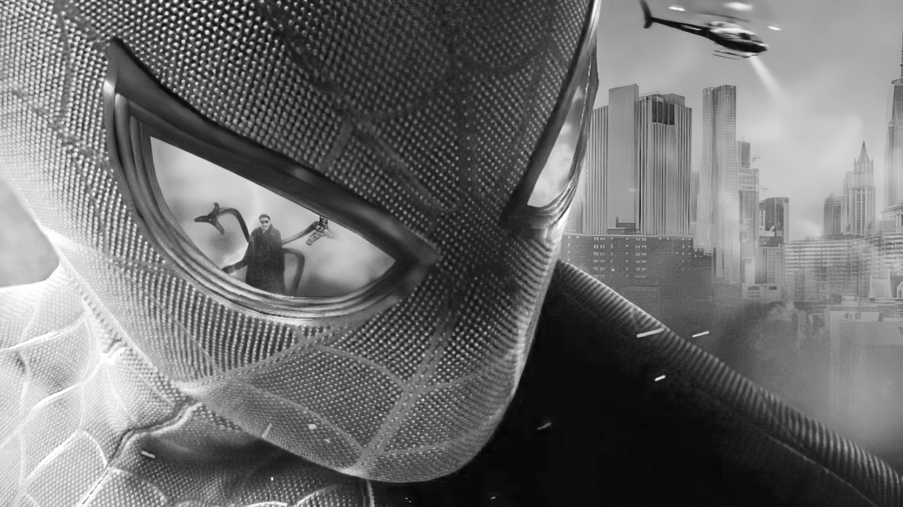

### Spiderman | Multiverse

    

-------
Uma experiência imersiva que combina o estilo retrô dos quadrinhos com efeitos digitais de glitch interdimensional. O site permite explorar universos icônicos, acessar perfis de diferentes Homens-Aranha e participar de missões interativas. Cada seção tem uma estética única, com trilhas sonoras e transições dinâmicas. Visualmente deslumbrante e cheio de nostalgia, o site é um portal perfeito para fãs do multiverso aracnídeo. 🕸️✨

## 💻 Tecnologias
- HTML
- CSS
- JavaScript

## 💬 Assuntos abordados
- HTML
    - Estruturação da página 
    - Semântica
    - Acessibilidade
    - Web Scraping
- CSS
    - Posicionamentos
    - Pseudo-elementos
    - Pseudo-classes
    - Flexbox
    - Animações 
- JavaScript
    - Introdução ao JavaScript
    - Manipulação do DOM

## 🔗 Link do projeto no Figma
- [Figma](https://www.figma.com/design/GjvdE0uob68X6pEHqw2pY8/Multiverse-Spider-Man?node-id=1-17&p=f)

## 🔗 Link da Learning Page

Para quem deseja jogar o jogo Detona Halph está disponivel neste site.

https://duarte-arthur21.github.io/spider-man-multiverses/ 